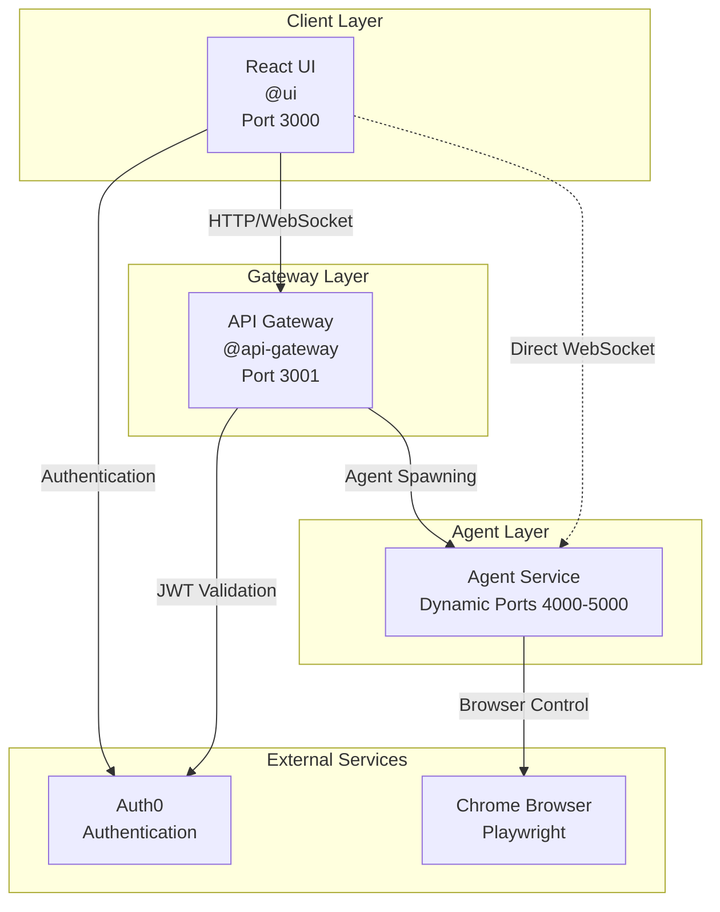
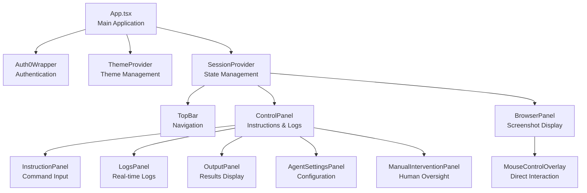
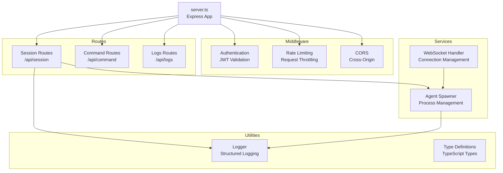
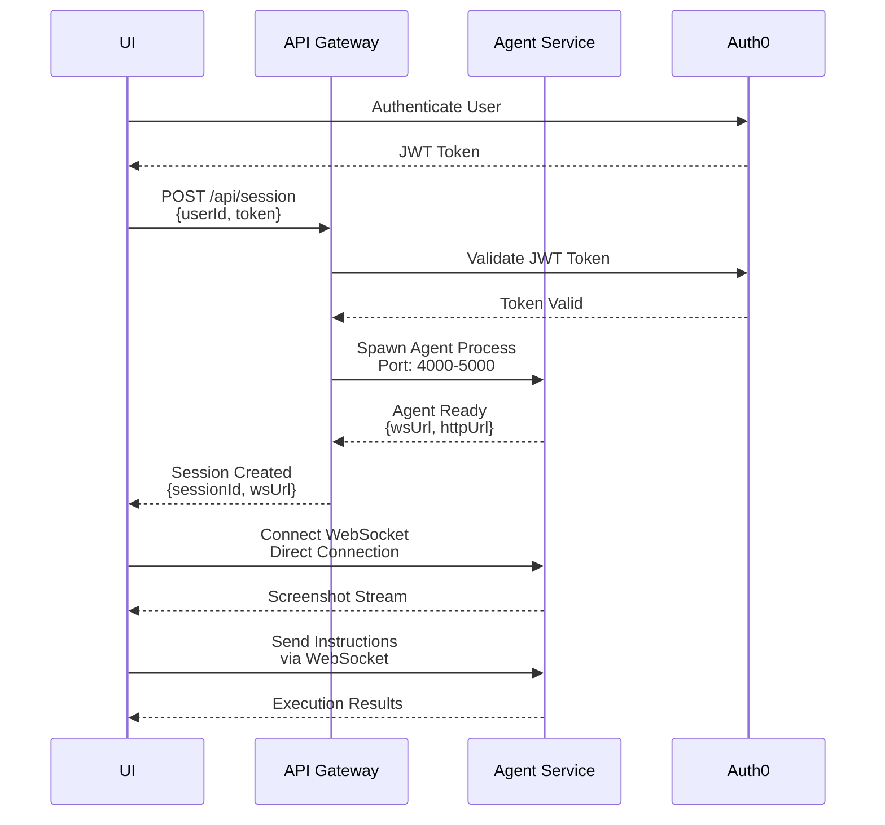
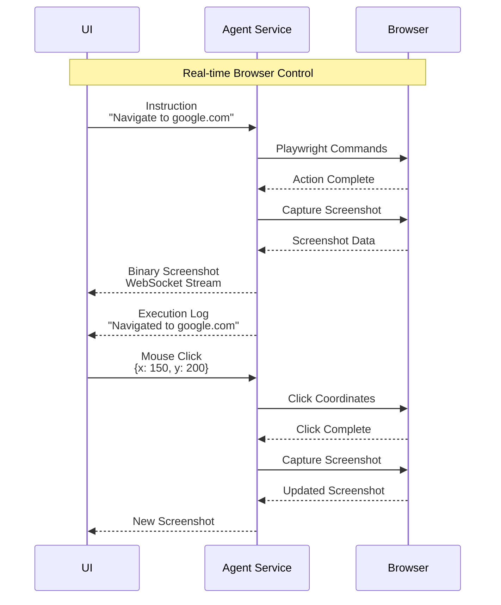
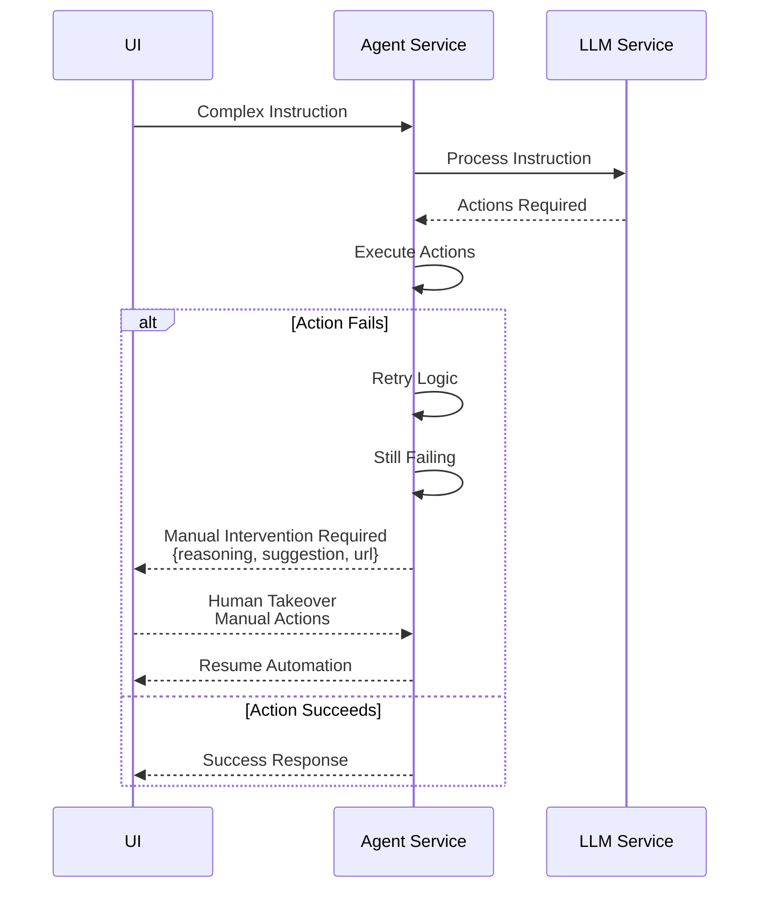
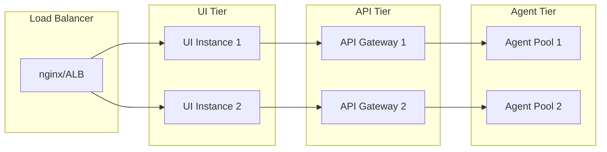

# Browser Automation System Architecture Documentation

## Overview

The Browser Automation System is a multi-tenant, secure browser automation platform consisting of two main services: the **UI** (@ui) and the **API Gateway** (@api-gateway). This document provides a comprehensive overview of their architecture, interactions, and data flow.

## System Architecture



## Service Descriptions

### @ui - React Frontend Application

**Technology Stack:**
- React 18 with TypeScript
- Tailwind CSS for styling
- Auth0 for authentication
- Axios for HTTP requests
- WebSocket for real-time communication

**Key Features:**
- Multi-tenant secure browser interface
- Real-time browser screenshot streaming
- Natural language instruction processing
- Manual intervention handling
- Responsive design with resizable panels

**Port:** 3000 (development)

### @api-gateway - Node.js Backend Service

**Technology Stack:**
- Express.js with TypeScript
- WebSocket (ws library)
- Auth0 JWT validation
- Rate limiting and CORS
- Agent process spawning

**Key Features:**
- Authentication and authorization
- Session management
- Agent instance spawning
- WebSocket proxying
- Health monitoring and logging

**Port:** 3001

## Component Architecture

### UI Component Hierarchy



### API Gateway Service Architecture



## Data Flow and Interactions

### Session Creation Flow



### Real-time Communication Flow



### Error Handling and Manual Intervention



## Key Interactions

### 1. Authentication Flow
- UI authenticates with Auth0
- JWT token passed to API Gateway
- API Gateway validates token for all requests
- Token used for WebSocket authentication

### 2. Session Management
- API Gateway spawns dedicated agent instances
- Each session gets unique port (4000-5000 range)
- Direct WebSocket connection from UI to Agent
- Session cleanup after inactivity

### 3. Real-time Communication
- **Screenshot Stream**: Binary WebSocket from Agent to UI
- **Instruction Flow**: JSON WebSocket from UI to Agent
- **Log Stream**: Server-Sent Events for real-time logs
- **Manual Intervention**: Bidirectional communication for human oversight

### 4. Agent Lifecycle
- **Spawning**: API Gateway creates agent processes on demand
- **Health Monitoring**: Regular health checks and heartbeats
- **Cleanup**: Automatic cleanup of inactive agents
- **Resource Management**: Port allocation and process management

## API Specifications

### UI to API Gateway Communication

#### HTTP Endpoints
- `POST /api/session` - Create new session
- `GET /api/session/:id` - Get session info
- `DELETE /api/session/:id` - Stop session
- `GET /health` - Health check

#### WebSocket Endpoints
- Direct connection to Agent Service (bypasses API Gateway)
- Authentication via JWT token in connection

### UI to Agent Service Communication

#### WebSocket Messages
```typescript
// Instruction Message
{
  id: string;
  text: string; // Natural language instruction
}

// Response Message
{
  id: string;
  status: 'success' | 'error' | 'timeout';
  executed?: string[]; // Code executed
  actions?: any[]; // Actions performed
  error?: string;
}

// Mouse Action
{
  actionType: 'click' | 'move' | 'scroll';
  x: number;
  y: number;
  button?: 'left' | 'right' | 'middle';
  clickCount?: number;
}
```

#### Binary Screenshot Stream
- Raw binary image data over WebSocket
- Efficient transfer for real-time display
- Canvas rendering in UI for smooth updates

## Security Features

### Authentication & Authorization
- Auth0 integration for secure authentication
- JWT token validation on all requests
- User-scoped sessions and data isolation

### Rate Limiting & Protection
- Configurable rate limiting on API Gateway
- CORS configuration for cross-origin requests
- Input validation and sanitization

### Multi-tenant Isolation
- Each user gets dedicated agent instances
- Process-level isolation for security
- Session-based resource allocation

## Performance Characteristics

### Real-time Requirements
- Screenshot streaming: <500ms latency
- Instruction processing: <2s response time
- WebSocket connections: <2s establishment time
- Canvas rendering: No visible flicker

### Resource Management
- Dynamic port allocation (4000-5000)
- Automatic agent cleanup after 1 hour inactivity
- Process spawning with health checks
- Memory-efficient screenshot streaming

## Deployment Architecture

### Development Environment
```
UI (localhost:3000) → API Gateway (localhost:3001) → Agent Service (localhost:4000+)
```

### Production Environment


## Monitoring and Observability

### Logging
- Structured logging with Winston
- Request/response logging
- WebSocket connection tracking
- Agent lifecycle events

### Health Monitoring
- Service health endpoints
- Agent process monitoring
- WebSocket connection status
- Resource utilization tracking

### Metrics
- Active session count
- Agent spawn/stop rates
- WebSocket connection metrics
- Error rates and types

## Future Enhancements

### Scalability
- Redis for session state management
- Horizontal scaling of API Gateway
- Container orchestration (Kubernetes)
- Message queue for async processing

### Features
- Session recording and playback
- Advanced error handling
- Custom agent configurations
- Integration with external APIs

### Security
- Advanced rate limiting
- Enhanced monitoring
- Audit logging
- Compliance features

## Troubleshooting Guide

### Common Issues

1. **WebSocket Connection Failures**
   - Check agent service health
   - Verify JWT token validity
   - Confirm port availability

2. **Agent Spawn Failures**
   - Check port range availability
   - Verify agent service dependencies
   - Review process spawn logs

3. **Authentication Issues**
   - Validate Auth0 configuration
   - Check JWT token expiration
   - Verify CORS settings

4. **Performance Issues**
   - Monitor agent resource usage
   - Check WebSocket buffer sizes
   - Review screenshot compression

This architecture provides a robust, scalable foundation for browser automation with strong security, real-time capabilities, and excellent user experience. 