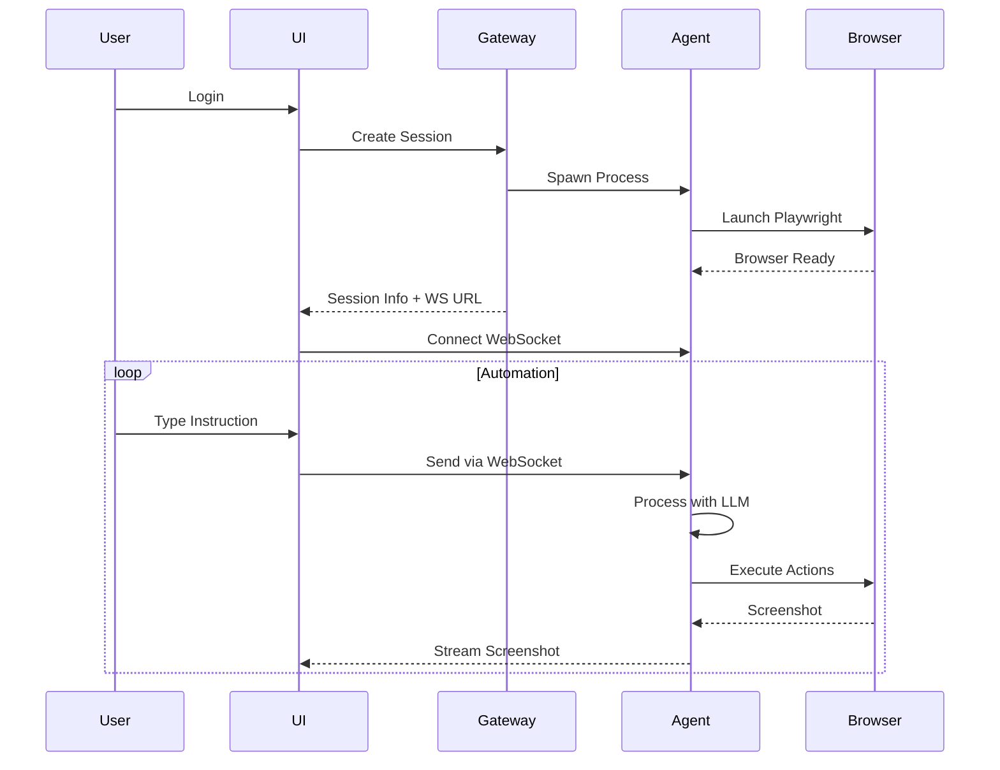

# Browser Automation System

A multi-service browser automation platform that enables natural language control of web browsers through an AI-powered agent system.

## Architecture Overview

The system consists of three interconnected services:

```
┌─────────────────┐    ┌─────────────────┐    ┌─────────────────┐
│   React UI      │────│  API Gateway    │────│  Agent Service  │
│   Port 3000     │    │   Port 3001     │    │ Ports 4000-5000 │
└─────────────────┘    └─────────────────┘    └─────────────────┘
        ↓                      ↓                       ↓
   User Interface      Session Management      Browser Control
   Auth0 Login         Agent Spawning         LLM Integration
   WebSocket Client    Request Routing        Screenshot Stream
```

## Services

### 1. UI Service (`/ui`)
- **Technology**: React 18 with TypeScript
- **Port**: 3000
- **Purpose**: Web interface for users to interact with the browser automation
- **Features**:
  - Auth0 authentication
  - Real-time screenshot display
  - Natural language instruction input
  - Manual mouse control overlay
  - Live logs and output display

### 2. API Gateway (`/api-gateway`)
- **Technology**: Express.js with TypeScript
- **Port**: 3001
- **Purpose**: Central hub for authentication, session management, and agent orchestration
- **Features**:
  - JWT authentication via Auth0
  - Dynamic agent spawning
  - Session lifecycle management
  - Rate limiting and security

### 3. Agent Service (`/agent`)
- **Technology**: Express.js + Playwright + OpenAI
- **Ports**: 4000-5000 (dynamically assigned)
- **Purpose**: Browser automation engine with AI capabilities
- **Features**:
  - Natural language instruction processing
  - Browser control via Playwright
  - Real-time screenshot streaming
  - DOM analysis for intelligent actions
  - Error recovery and manual intervention detection

## Quick Start

### Prerequisites
- Node.js 18+
- npm or yarn
- Auth0 account (for authentication)
- OpenAI API key (for LLM features)

### Setup

1. **Clone and navigate to the browser directory:**
   ```bash
   cd browser
   ```

2. **Configure environment variables:**

   **API Gateway** (`api-gateway/.env`):
   ```env
   PORT=3001
   AUTH0_DOMAIN=your-domain.auth0.com
   AUTH0_AUDIENCE=your-api-audience
   NODE_ENV=development
   ```

   **Agent** (`agent/.env`):
   ```env
   OPENAI_API_KEY=your-openai-api-key
   HEADLESS=false
   ```

3. **Start all services:**
   ```bash
   ./start-all-services.sh
   ```

   This script will:
   - Check port availability
   - Install dependencies for all services
   - Create default .env files
   - Start the API Gateway and UI
   - Agent instances are spawned on-demand

4. **Access the application:**
   - Open http://localhost:3000 in your browser
   - Log in with Auth0
   - Start sending instructions!

## How It Works

### Connection Flow

1. **User Authentication**
   - User visits UI and authenticates via Auth0
   - UI receives JWT token

2. **Session Creation**
   - UI calls `POST /api/session` on API Gateway with JWT
   - API Gateway validates token and spawns a dedicated Agent instance
   - Returns WebSocket URL for direct Agent connection

3. **Real-time Communication**
   - UI connects directly to Agent via WebSocket
   - Receives screenshot stream and logs
   - Sends instructions and mouse actions

### Data Flow



## API Reference

### API Gateway Endpoints

#### Create Session
```http
POST /api/session
Authorization: Bearer {jwt_token}
Content-Type: application/json

{
  "userId": "user123"
}
```

Response:
```json
{
  "sessionId": "uuid",
  "wsUrl": "ws://localhost:4000",
  "httpUrl": "http://localhost:4000",
  "status": "running"
}
```

### WebSocket Protocol

#### Send Instruction
```json
{
  "type": "instruction",
  "data": {
    "id": "msg-uuid",
    "text": "Navigate to google.com and search for AI news"
  }
}
```

#### Mouse Action
```json
{
  "type": "mouse_action",
  "data": {
    "actionType": "click",
    "x": 100,
    "y": 200,
    "button": "left"
  }
}
```

## Development

### Running Individual Services

**UI Development:**
```bash
cd ui
npm install
npm start
```

**API Gateway Development:**
```bash
cd api-gateway
npm install
npm run dev
```

**Agent Development:**
```bash
cd agent
npm install
PORT=4000 npm run dev
```

### Testing

Each service has its own test suite:
```bash
cd [service-directory]
npm test
```

## Architecture Details

### Security
- Auth0 JWT authentication on all API calls
- User-isolated agent instances
- Rate limiting on API Gateway
- Input validation and sanitization

### Performance
- Binary WebSocket for efficient screenshot streaming
- Debounced screenshot capture (configurable interval)
- Connection pooling and reuse
- Automatic cleanup of inactive sessions

### Scalability
- Horizontal scaling of API Gateway
- Dynamic agent spawning (up to 1000 concurrent)
- Session-based resource isolation
- Automatic port management

## Troubleshooting

### Common Issues

1. **Port Already in Use**
   - Check if services are already running
   - Kill existing processes: `lsof -ti:3000 | xargs kill`

2. **WebSocket Connection Failed**
   - Verify agent is running on expected port
   - Check browser console for connection errors
   - Ensure no firewall blocking

3. **Authentication Issues**
   - Verify Auth0 configuration
   - Check JWT token expiration
   - Ensure correct audience/domain

4. **Agent Spawn Failures**
   - Check available ports (4000-5000)
   - Verify Node.js permissions
   - Check agent logs in `browser/agent.log`

### Logs

- UI logs: Browser console
- API Gateway: `browser/api-gateway.log`
- Agent: `browser/agent.log` (when spawned)

## Contributing

1. Fork the repository
2. Create a feature branch
3. Make your changes
4. Add tests
5. Submit a pull request

## License

[Your License Here] 