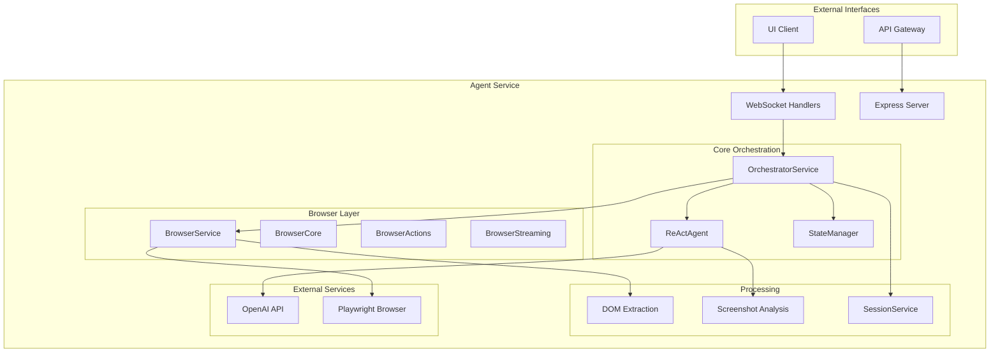
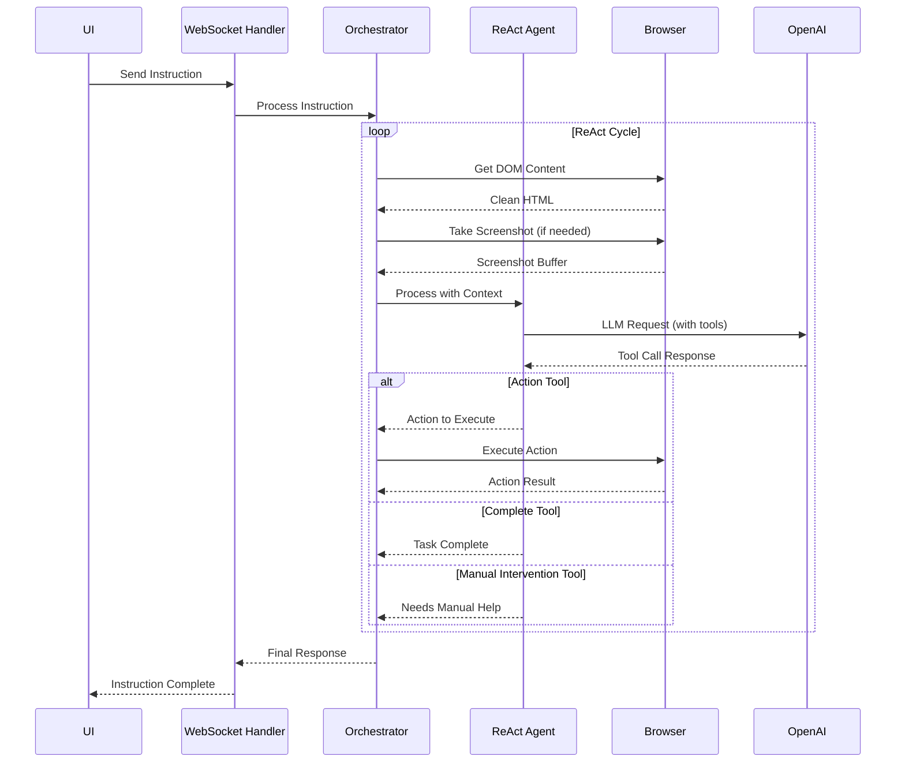
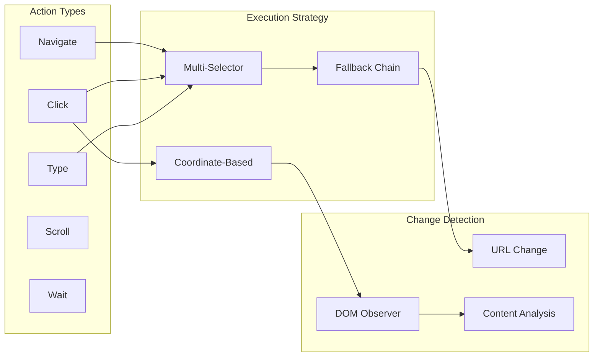
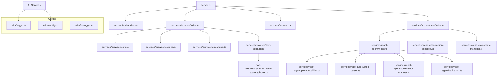
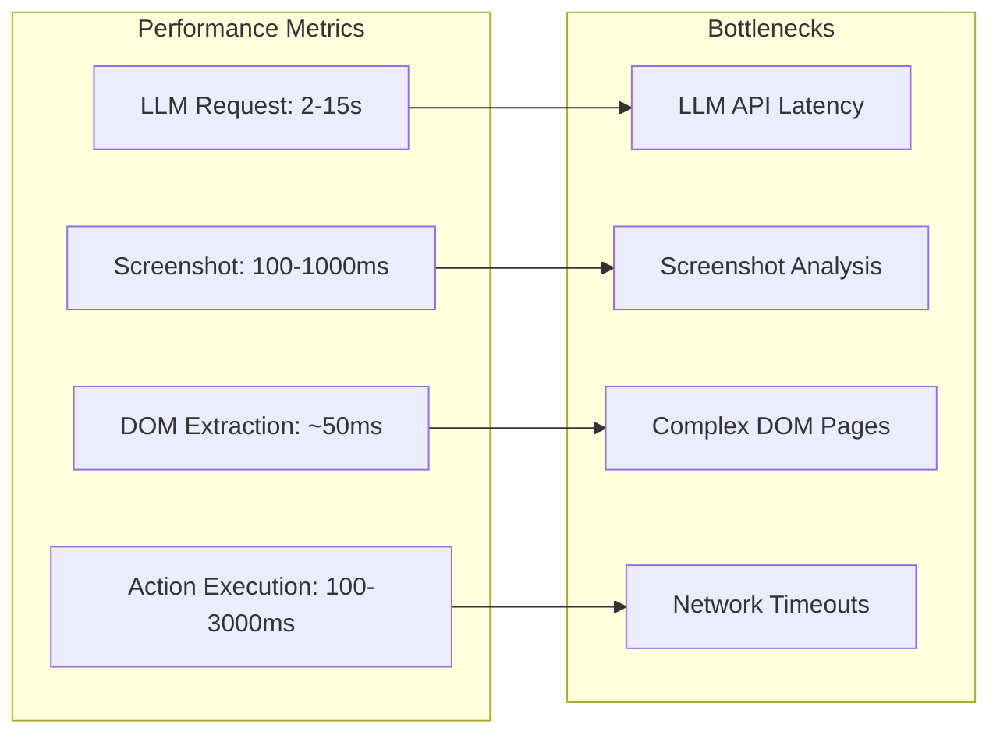

# Browser Agent Service - Code Review & Architecture Guide

## 📋 Table of Contents
1. [Project Overview](#project-overview)
2. [Architecture Overview](#architecture-overview)
3. [Core Components Flow](#core-components-flow)
4. [File Structure & Dependencies](#file-structure--dependencies)
5. [Guided Reading Path](#guided-reading-path)
6. [Code Quality Assessment](#code-quality-assessment)
7. [Performance Analysis](#performance-analysis)
8. [Security Considerations](#security-considerations)
9. [Recommendations](#recommendations)

## 🎯 Project Overview

The Browser Agent Service is a sophisticated TypeScript-based automation system that combines:
- **Playwright** for browser control
- **OpenAI GPT-4** for intelligent decision making
- **ReAct Framework** for reasoning and action cycles
- **WebSocket** for real-time communication
- **DOM Extraction** for efficient content processing

### Key Capabilities
- Natural language instruction processing
- Autonomous web navigation and interaction
- Manual intervention detection and handling
- Real-time screenshot streaming
- Comprehensive logging and monitoring

## 🏗️ Architecture Overview



## 🔄 Core Components Flow

### Instruction Processing Flow



### Browser Action Execution Flow



## 📁 File Structure & Dependencies

### High-Level Structure
```
browser/agent/
├── src/
│   ├── server.ts                 # Entry point & WebSocket setup
│   ├── services/                 # Core business logic
│   │   ├── browser/             # Browser control & automation
│   │   ├── orchestrator/        # Instruction coordination
│   │   ├── react-agent/         # LLM reasoning & actions
│   │   └── session.ts           # Session state management
│   ├── websocket/               # Real-time communication
│   ├── types/                   # TypeScript interfaces
│   └── utils/                   # Utilities & configuration
├── logs/                        # Session-based logging
└── package.json                # Dependencies & scripts
```

### Service Dependencies Map



## 📖 Guided Reading Path

### Phase 1: Foundation & Entry Points
**Goal**: Understand how the service starts and handles requests

1. **`package.json`** - Dependencies and scripts
2. **`src/server.ts`** - Main entry point, WebSocket setup, process management
3. **`src/types/index.ts`** - Core interfaces and types
4. **`src/utils/config.ts`** - Configuration and environment setup

### Phase 2: Communication Layer
**Goal**: Understand client-server communication

5. **`src/websocket/handlers.ts`** - WebSocket message handling and routing
6. **`src/websocket/streams.ts`** - Server-Sent Events for logging
7. **`src/services/session.ts`** - Session state management

### Phase 3: Core Orchestration
**Goal**: Understand instruction processing flow

8. **`src/services/orchestrator/index.ts`** - Main orchestration logic
9. **`src/services/orchestrator/state-manager.ts`** - Processing state management
10. **`src/services/orchestrator/action-executor.ts`** - Action execution and change detection

### Phase 4: ReAct Framework
**Goal**: Understand AI reasoning and decision making

11. **`src/services/react-agent/types.ts`** - ReAct framework types
12. **`src/services/react-agent/validation.ts`** - Tool definitions and validation schemas
13. **`src/services/react-agent/step-parser.ts`** - Tool call parsing
14. **`src/services/react-agent/prompt-builder.ts`** - Prompt construction
15. **`src/services/react-agent/screenshot-analyzer.ts`** - Visual analysis
16. **`src/services/react-agent/index.ts`** - Main ReAct processing logic

### Phase 5: Browser Control
**Goal**: Understand browser automation

17. **`src/services/browser/types.ts`** - Browser service types
18. **`src/services/browser/core.ts`** - Browser lifecycle management
19. **`src/services/browser/actions.ts`** - DOM interactions and actions
20. **`src/services/browser/streaming.ts`** - Real-time screenshot streaming
21. **`src/services/browser/dom-extraction/minimization-strategy/index.ts`** - DOM content extraction
22. **`src/services/browser/index.ts`** - Browser service facade

### Phase 6: Supporting Systems
**Goal**: Understand logging, monitoring, and utilities

23. **`src/utils/logger.ts`** - Logging facade and coordination
24. **`src/utils/file-logger.ts`** - File-based session logging
25. **`src/utils/withRetry.ts`** - Retry mechanisms for external calls

## 🔍 Code Quality Assessment

### ✅ Strengths

#### 1. **Architecture & Design**
- **Clean Separation of Concerns**: Each service has a well-defined responsibility
- **Modular Design**: Services are loosely coupled and can be tested independently
- **Facade Pattern**: Browser service provides clean abstraction over complex subsystems
- **Strategy Pattern**: DOM extraction uses pluggable strategies

#### 2. **Error Handling**
- **Graceful Degradation**: Fallback mechanisms throughout the system
- **Comprehensive Logging**: Detailed error context and debugging information
- **Retry Logic**: Robust retry mechanisms for external API calls
- **Resource Cleanup**: Proper cleanup on errors and shutdown

#### 3. **Performance Optimizations**
- **Selective Screenshot Analysis**: Only takes screenshots when needed based on LLM classification
- **DOM Token Budgeting**: Intelligent content truncation to fit LLM context limits
- **Connection Pooling**: Efficient WebSocket connection management
- **Streaming**: Real-time screenshot streaming for better UX

#### 4. **Type Safety**
- **Comprehensive TypeScript**: Strong typing throughout the codebase
- **Schema Validation**: Zod schemas for runtime validation
- **Interface Segregation**: Well-defined contracts between services

### ⚠️ Areas for Improvement

#### 1. **Code Complexity**
```typescript
// ❌ Complex nested conditions in orchestrator
if (!this.stateManager.startProcessing(instruction.id)) {
  const wasProcessed = this.stateManager.wasInstructionProcessed(instruction.id);
  const errorMessage = wasProcessed ? 'Instruction already processed' : 'Already processing an instruction';
  // ... more nested logic
}
```

**Recommendation**: Extract to dedicated validation methods

#### 2. **Magic Numbers**
```typescript
// ❌ Hardcoded values throughout codebase
const maxSteps = 15;
const maxLength = 30000;
const screenshotInterval = 50;
```

**Recommendation**: Move to configuration constants

#### 3. **Large Functions**
- `processWithReAct()` in orchestrator (300+ lines)
- `handleMessage()` in WebSocket handlers (200+ lines)

**Recommendation**: Break down into smaller, focused functions

## 📊 Performance Analysis

### Current Performance Characteristics



### Optimization Opportunities

1. **LLM Request Optimization**
   - Current: Serial LLM calls in ReAct loop
   - Potential: Batch multiple steps or use streaming responses

2. **DOM Processing**
   - Current: Full DOM re-extraction each cycle
   - Potential: Incremental DOM diffing and caching

3. **Screenshot Efficiency**
   - Current: PNG screenshots (larger files)
   - Potential: JPEG with quality optimization or selective regions

## 🔒 Security Considerations

### Current Security Measures ✅
- **Input Validation**: Zod schemas validate all inputs
- **Process Isolation**: Each session runs in isolated process
- **Resource Limits**: Token budgets and timeout constraints
- **No Direct Database Access**: Stateless session management

### Security Recommendations 🛡️

1. **Enhanced Input Sanitization**
   ```typescript
   // Add URL validation for navigation
   const isValidUrl = (url: string) => {
     try {
       const parsed = new URL(url);
       return ['http:', 'https:'].includes(parsed.protocol);
     } catch {
       return false;
     }
   };
   ```

2. **Rate Limiting**
   ```typescript
   // Add per-session rate limiting
   interface RateLimit {
     requests: number;
     windowStart: number;
     maxRequests: number;
     windowMs: number;
   }
   ```

3. **Content Security**
   - Sanitize DOM content before LLM processing
   - Validate file paths for logging
   - Implement CSP headers for any web interfaces

## 🚀 Recommendations

### Immediate Actions (Sprint 1)

1. **Extract Configuration Constants**
   ```typescript
   // Create src/utils/constants.ts
   export const PERFORMANCE_LIMITS = {
     MAX_REACT_STEPS: 15,
     DOM_MAX_LENGTH: 30000,
     SCREENSHOT_INTERVAL: 50,
     LLM_TIMEOUT: 30000
   } as const;
   ```

2. **Simplify Large Functions**
   ```typescript
   // Break down processWithReAct into smaller methods
   class OrchestratorService {
     private async validateInstruction(instruction: InstructionMessage): Promise<boolean>
     private async executeReActCycle(context: ProcessingContext): Promise<ReActResult>
     private async handleActionExecution(step: ReActStep): Promise<ActionResult>
   }
   ```

3. **Add Health Checks**
   ```typescript
   // Enhanced health endpoint with service status
   app.get('/health', async (req, res) => {
     const health = {
       status: 'healthy',
       services: {
         browser: await this.browser.isHealthy(),
         llm: await this.reactAgent.isHealthy(),
         session: this.session.isActive()
       }
     };
   });
   ```

### Medium-term Improvements (Sprint 2-3)

4. **Performance Monitoring**
   ```typescript
   // Add performance metrics collection
   class PerformanceMonitor {
     trackLLMLatency(duration: number, tokenCount: number): void
     trackActionSuccess(actionType: string, success: boolean): void
     trackDOMProcessingTime(duration: number, tokenCount: number): void
   }
   ```

5. **Enhanced Error Recovery**
   ```typescript
   // Implement circuit breaker pattern for external services
   class CircuitBreaker {
     private failures = 0;
     private lastFailure?: Date;
     
     async execute<T>(operation: () => Promise<T>): Promise<T>
   }
   ```

6. **Caching Layer**
   ```typescript
   // Cache DOM content and screenshots for recent URLs
   interface CacheEntry {
     content: string;
     screenshot?: Buffer;
     timestamp: number;
     ttl: number;
   }
   ```

### Long-term Enhancements (Sprint 4+)

7. **Multi-Agent Coordination**
   - Support for multiple concurrent browser sessions
   - Agent-to-agent communication protocols
   - Resource sharing and coordination

8. **Advanced AI Capabilities**
   - Fine-tuned models for specific automation tasks
   - Learning from user corrections and feedback
   - Predictive pre-loading of likely next actions

9. **Scalability Improvements**
   - Horizontal scaling with load balancing
   - Database persistence for session state
   - Distributed caching with Redis

## 📈 Metrics & KPIs

### Performance KPIs
- **Instruction Success Rate**: Target >90%
- **Average Processing Time**: Target <30s per instruction
- **LLM Token Efficiency**: Target <10k tokens per instruction
- **Screenshot Analysis Accuracy**: Target >95%

### Quality KPIs
- **Error Rate**: Target <5%
- **Manual Intervention Rate**: Target <20%
- **System Uptime**: Target >99.5%
- **Memory Usage**: Target <2GB per session

## 🎯 Conclusion

The Browser Agent Service demonstrates excellent architectural principles with strong separation of concerns, comprehensive error handling, and robust performance optimizations. The ReAct framework integration is particularly well-implemented, providing intelligent decision-making capabilities.

Key strengths include the modular design, type safety, and comprehensive logging system. Primary improvement areas focus on reducing code complexity, extracting configuration constants, and enhancing performance monitoring.

The service is production-ready with the recommended immediate improvements, and the suggested medium and long-term enhancements will significantly improve scalability and maintainability.

---

**Next Steps**: 
1. Review this document with the team
2. Prioritize recommendations based on business impact
3. Create implementation tickets for immediate actions
4. Set up monitoring for suggested KPIs 